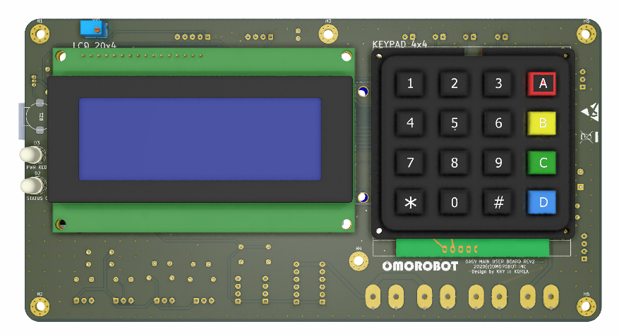
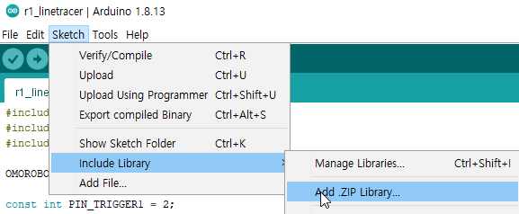

# Omorobot Autonomous Guided Vehicle(OAGV) User Main controller

This project is about User and Main control progrom for OAGV.  
User program is for displaying information and get user input from keypad.  
Main program is for controlling Omorobot's motor driver module per line sensor input to keep track of line following.  

이 프로젝트는 OAGV를 구동하기 위한 메인 및 유저 인터페이스 프로그램을 포함하고 있습니다.
유저 프로그램은 OAGV의 상태를 표시하고 목적지에 대한 사용자 입력을 전달받습니다.
메인 프로그램은 오모로봇의 모터 드라이버 모듈과 라인센서 및 태그 리더기를 통해 들어온 데이터를 이용하여 동작을 제어합니다.  

유저 메인 제어기의 형상은 아래와 같습니다.  

  

## 참조 라이브러리

 이 프로젝트는 다음 라이브러리를 참조합니다.
  - [arduino-Keypad 라이브러리](https://www.arduino.cc/reference/en/libraries/keypad/)  에서 최신 버전의 zip 파일을 다운로드 합니다. (2020-10-12 현재 [3.1.1](http://downloads.arduino.cc/libraries/github.com/Chris--A/Keypad-3.1.1.zip) )
  - [arduino-mcp2515 라이브러리](https://github.com/autowp/arduino-mcp2515) 에서 zip 파일을 다운로드합니다.  
  - Arduino IDE를 열고 스케치 > Include Library > Add .ZIP Library 를 선택하여 다운로드한 파일을 선택  

  

## 라이센스 및 권리

이 소프트웨어는 (주)오모로봇 R1 플랫폼을 위하여 유규형 ([kyuhyoong@omorobot.com](kyuhyoong@omorobot.com "kyuhyoong@omorobot.com"))에 의해 작성되었으며 별다른 명시를 하지 않는 한 [GNU General Public License (GPLv2)](https://www.gnu.org/licenses/old-licenses/gpl-2.0.en.html)를 따릅니다.  
누구나 자유롭게 이 소프트웨어를 활용하여 R1 응용 프로그램을 작성하기 위하여 [포크](https://help.github.com/articles/fork-a-repo)하거나, 코드를 개선, 또는 변경하기 위해여 [풀링 요청](https://help.github.com/articles/using-pull-requests)을 할 수 있습니다.  
문제가 있거나 버그를 발견한 경우 issue에 남겨주시면 검토할 수 있지만 동작을 보장하지는 않습니다.
